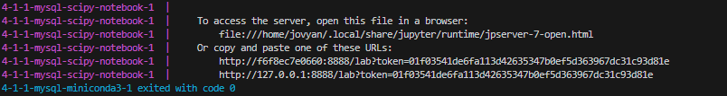

# Коллективный проект команды №4-1-1
Проект включает в себя базу данных в области прогнозирования диабета. 
## Что включает в себя база данных?
**CSV данные в области прогноза диабета — [Kaggle](https://www.kaggle.com/datasets/iammustafatz/diabetes-prediction-dataset/data)**
> Набор данных для прогнозирования диабета представляет собой совокупность медицинских и демографических данных пациентов, а также их статуса диабета (положительного или отрицательного). Данные включают в себя такие характеристики, как возраст, пол, индекс массы тела (ИМТ), гипертония, болезни сердца, история курения, уровень HbA1c и уровень глюкозы в крови. Этот набор данных можно использовать для создания моделей машинного обучения для прогнозирования диабета у пациентов на основе их истории болезни и демографической информации. Это может быть полезно для медицинских работников при выявлении пациентов, которые могут подвергаться риску развития диабета, и при разработке индивидуальных планов лечения. Кроме того, набор данных может быть использован исследователями для изучения взаимосвязи между различными медицинскими и демографическими факторами и вероятностью развития диабета.
## Как использовать проект?
### [db4free.net](https://db4free.net)
### Как запустить проект при помощи Docker
1. Для начала нужно установить [Docker](https://www.docker.com/get-started/).
2. После установки Docker, запустите его, а затем перейдите в командную строку с директорией этого проекта. Как это сделать, можно почитать [здесь](https://qna.habr.com/q/555833).
3. Когда вы находитесь в корневой папке проекта, пропишите следующие команды: ` docker-compose build ` и ` docker-compose up `
4. Дальше произойдет установка образов, которые требуются для проекта. Как только установка завершится, у вас запустятся контейнеры под следующими портами:
    
    * **127.0.0.1:8080** : phpMyAdmin, на котором в дальнейшем будет разворачиваться база данных `diabet_predict` *MySQL 8.0*. В файле `docker-compose.yml` указаны данные для авторизации (по умолчанию).
    * **127.0.0.1:8888** : Jupyter Notebook, на котором можно выполнить визуализацию и анализ данных. Все файлы для работы с данными хранятся в директории _**/notebooks/**_. Для авторизации требуется токен, который генерируется каждый раз случайно *(чтобы его получить, достаточно найти его при запуске в командной строке)*.
### Участники проекта и распределения задач
* [Истомин Алексей Александрович](https://github.com/testmapper-official)
    
    * Описание проекта, распределение задач, проект-менеджмент
    * Работа с Docker
    * Создание ER-диаграммы, БД
* [Жубаназарова Карина Айбулатовна](https://github.com/zhubikKar)

    * Импорт данных в БД
    * WEB-разверстка на db4free.net 
* [Денисов Евгений Александрович](https://github.com/zhiznenyj)

    * Обработка и визуализация данных на скрипте Python.
